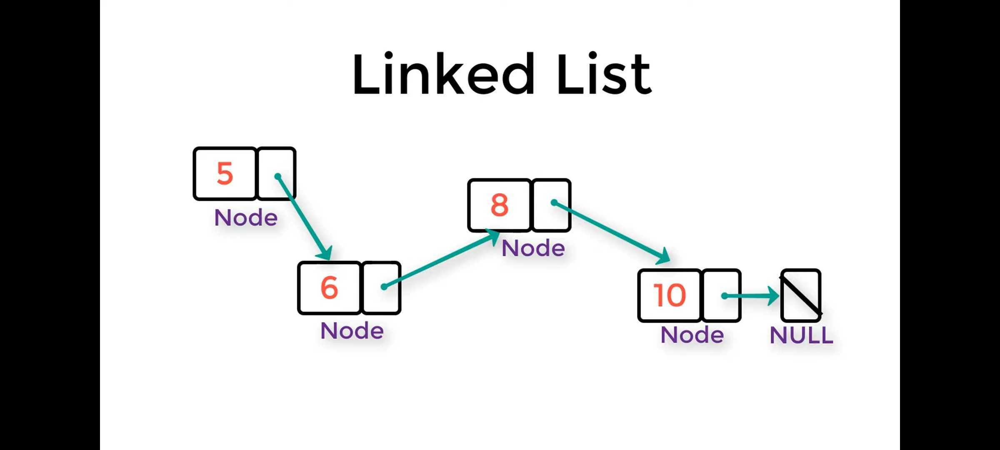
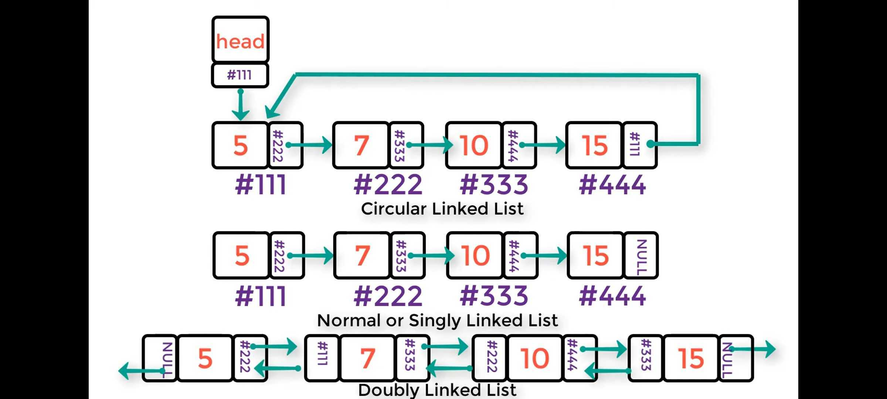

# Linked list 

* First, let's familiarize ourselves with the list. This is a term for any group of elements that are linked together, e.g. B. an array: group of elements as a multi linked block

>* Why?
> With the presence of the array, what is the difference between the array and the list? One of the problems with arrays is that it's a fixed size, has to be stored sequentially in memory, and wastes space. As for the list, it's just the opposite, it's dynamically sized and stored in memory randomly rather than sequentially, but random access isn't allowed here.

> * How do we know that the elements of the list apply to a single list since the elements of the list are stored randomly in memory and don't need to be stored sequentially?
 > Each element of the list consists of two parts, an item and a pointer, that go together referred to as a node, the address of the second element of the list stored in the pointer.

 

> **_Linked list types:_**
>* Normal or singly linked list
> * Circular linked list
> * Doubly linked list 

 

 ----

 # Big O

 >Big-O notation is a simplified analysis of an algorithm's efficiency. Big O gives us an algorithm complexity in terms of input size n. It gives us the ability to abstract the efficiency of our algorithms or codes from the machines they run on, we can use it to analyze both time and space. There are different ways to look at the sufficiency of an algorithm. We can examine the worst case, the best case, and the average case. When we talk about Big-O notation, we typically look at worst case.